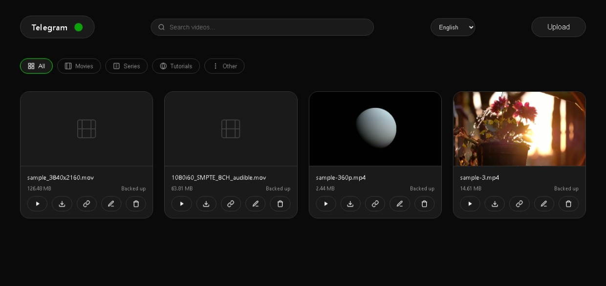

# 🎬 Unlimited - Telegram Cloud Video Platform

A modern, minimalist video streaming platform that leverages Telegram as an unlimited cloud storage backend. Stream, store, and manage your videos with a beautiful and intuitive dark-themed interface.



<p align="center">
  
  
  
</p>

## ✨ Core Features

| Feature | Description |
| --- | --- |
| 🚀 **Unlimited Storage** | Leverages Telegram's cloud infrastructure for virtually limitless video storage, bypassing local server limitations. |
| ⚡ **Adaptive Streaming** | Automatically converts videos to HLS for smooth, high-quality playback. Supports **quality switching**. |
| 🎞️ **Video Compression** | Intelligently reduces file sizes upon upload to save bandwidth and speed up streaming, without significant loss in visual quality. |
| 📡 **Redundant Streaming** | Ensures high availability by streaming directly from Telegram's distributed network, with robust fallback mechanisms. |
| ⬆️ **Smart Processing** | Handles large file uploads with real-time progress and performs background processing for thumbnails and HLS conversion. |
| 🌐 **Multi-Language** | A flexible language framework allows for easy internationalization and localization of the user interface. |
| 🔗 **Secure Sharing** | Generate temporary, secure links to share videos with others, with control over expiration. |
| 🌑 **Modern UI/UX** | A sleek, responsive dark theme with custom icons, smooth animations, and an intuitive layout for a superior user experience. |

## 🛠️ Installation

### Prerequisites
-   **Node.js** (v14 or higher)
-   **FFmpeg** (must be in your system's PATH for video processing)
-   A **Telegram Bot Token**

### Setup Steps

1. **Clone the repository**
```bash
git clone https://github.com/friday2su/unlimited.git
cd unlimited
```

2.  **Install Dependencies**
    ```bash
    npm install
    ```

3.  **Configure Environment**
    Create a `.env` file in the root directory and add the following:
    ```env
    # Telegram Bot Configuration
    TELEGRAM_BOT_TOKEN=your_bot_token_here
    TELEGRAM_CHANNEL_ID=your_channel_id_here

    # Server Configuration
    PORT=3000
    ```

4.  **Create a Telegram Bot**
    -   Open **[@BotFather](https://t.me/botfather)** on Telegram and create a new bot with `/newbot`.
    -   Copy the bot token into your `.env` file.
    -   Create a private channel, add your bot as an administrator, and get the channel ID.

5.  **Start the Server**
    ```bash
    npm start
    ```

6.  **Access the Platform**
    Open your browser and navigate to `http://localhost:3000`.

## 📖 Usage

-   **Upload**: Click the "Upload" button, or drag-and-drop a video file to start the upload process.
-   **Stream**: Click on any video card to open the player and begin streaming.
-   **Manage**: Use the icons on each video card to download, copy the stream URL, or delete the video.

## 🔮 Upcoming Features

- `[ ]` **Dual-Audio & Subtitle Support**: Full support for multiple audio tracks and subtitles (SRT, VTT).
- `[ ]` **Playlist Management**: Create, edit, and share custom video playlists.
- `[ ]` **Secure API with Authentication**: A well-documented API with token-based authentication for third-party integrations.
- `[ ]` **User Authentication**: Secure, multi-user support with registration and profile management.
- `[ ]` **Advanced Search & Filtering**: Quickly find videos by name, tags, or category.
- `[ ]` **Live Streaming**: Broadcast live video directly through the platform.

## 🤝 Contributing

Contributions are welcome! Please feel free to fork the repository, create a feature branch, and submit a Pull Request.

1.  Fork the repository.
2.  Create your feature branch (`git checkout -b feature/NewFeature`).
3.  Commit your changes (`git commit -m 'Add some NewFeature'`).
4.  Push to the branch (`git push origin feature/NewFeature`).
5.  Open a Pull Request.

## 📝 License

This project is licensed under the MIT License. See the [LICENSE](LICENSE) file for details.

---
*This project is for educational purposes. Please ensure you comply with Telegram's terms of service.*
